```mermaid
flowchart TB
    %% Frontend Layer
    subgraph "Frontend Layer"
        Browser["Web Browser (UI)"]:::frontend
        Template["Jinja2 Template<br/>(templates/index.html)"]:::frontend
    end

    %% HTTP Layer
    subgraph "HTTP Layer"
        HTTP["HTTP Request/Response"]:::infra
    end

    %% Backend Layer
    subgraph "Backend Layer"
        Flask["app.py (Flask App)"]:::backend
        requirements["requirements.txt"]:::backend
    end

    %% Metadata
    subgraph "Project Metadata"
        README["README.md"]:::metadata
        Gitignore[".gitignore"]:::metadata
    end

    %% Data Flow
    Browser -->|"GET/POST"| HTTP
    HTTP -->|"routes to"| Flask
    Flask -->|"renders with data"| Template
    Template -->|"HTML response"| HTTP
    HTTP -->|"delivers HTML"| Browser
    Flask -->|"declares dependencies"| requirements

    %% Legend
    subgraph "Legend"
        L1["<span style='color:#add8e6'>&#9608;&#9608;&#9608;</span> Frontend Layer"]
        L2["<span style='color:#90ee90'>&#9608;&#9608;&#9608;</span> Backend Layer"]
        L3["<span style='color:#d3d3d3'>&#9608;&#9608;&#9608;</span> Metadata/Infra"]
    end

    %% Click Events
    click Template "https://github.com/geethasagarb/tip-calculator/blob/main/templates/index.html"
    click Flask "https://github.com/geethasagarb/tip-calculator/blob/main/app.py"
    click requirements "https://github.com/geethasagarb/tip-calculator/blob/main/requirements.txt"
    click README "https://github.com/geethasagarb/tip-calculator/blob/main/README.md"
    click Gitignore "https://github.com/geethasagarb/tip-calculator/blob/main/.gitignore"

    %% Styles
    classDef frontend fill:#add8e6,stroke:#333,stroke-width:1px;
    classDef backend fill:#90ee90,stroke:#333,stroke-width:1px;
    classDef infra fill:#ffa500,stroke:#333,stroke-width:1px;
    classDef metadata fill:#d3d3d3,stroke:#333,stroke-width:1px;
```

#  Tip 🤔

Hey there! 

This is **Tip**, a tiny but smart tip calculator I built as a fun side project. It's built using **Flask**, has a clean UI with **light/dark mode**, and even remembers your past tip calculations using a **SQLite database**.

I made this to get better at deploying real-world apps and just to have something of my own that actually works online 😄

---

## 🛠️ What it does

- You enter your **meal cost** (like `$45.00`)
- Enter a **tip percentage** (like `15%`)
- Hit "Calculate" and it'll show you the tip 💰
- Behind the scenes, it stores your tip in a mini database (just for you)

---
