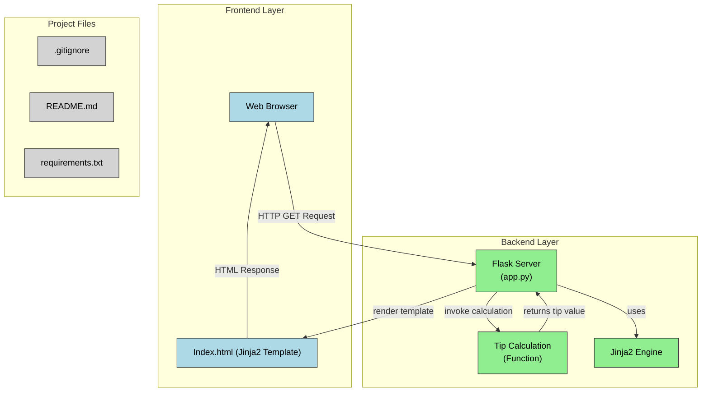

# Tip 🤔

Hey there!

**Tip** is a tiny, fun tip calculator I built using Flask. It has a clean UI, works in light and dark mode, and even remembers your past tips using a small SQLite database.

I made it to get better at deploying real apps and to have something of my own that actually runs online 😄

---

## What it does

- Enter your meal cost (like `$50.00`)
- Enter a tip % (like `15%`)
- It calculates your tip instantly 💸
- Stores your tips in a local database (SQLite)

---

##  Try it live

👉 [Live App](https://tip-ug1e.onrender.com)

---

## 🧪 Run it locally

```bash
git clone https://github.com/geethasagarb/Tip-Calculator.git
cd Tip-Calculator
pip install -r requirements.txt
python app.py
